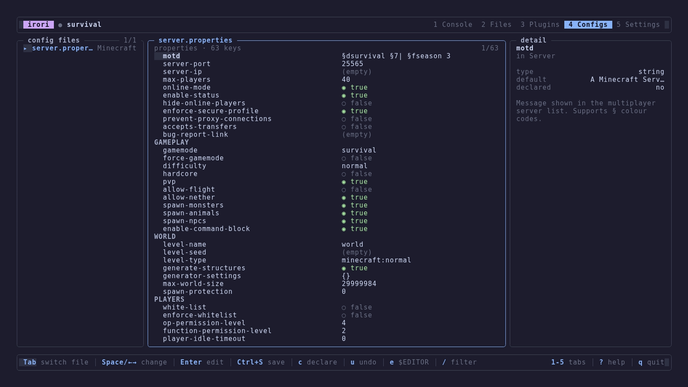
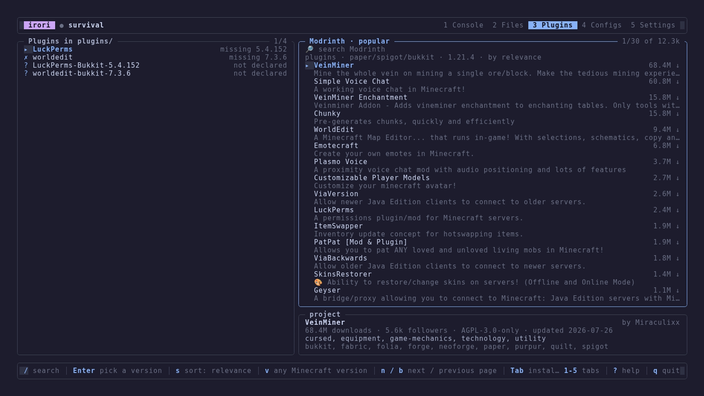
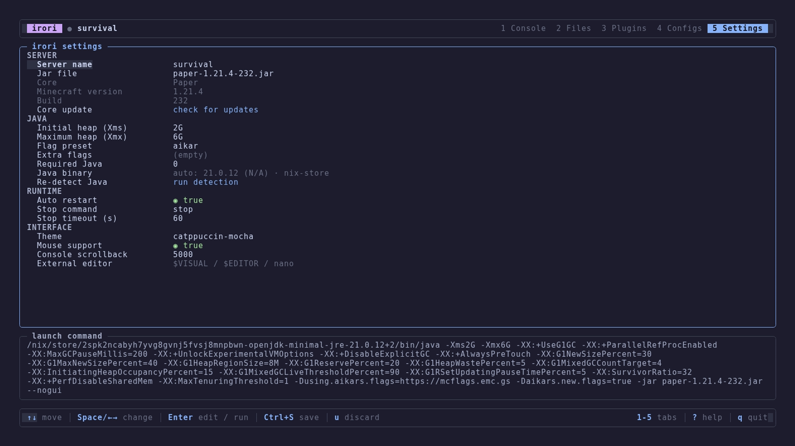

<div align="center">

# irori

*From the Japanese 囲炉裏 — the sunken hearth in the floor of a traditional house, the fire a household keeps lit and gathers around.*

A terminal UI for running a Minecraft server. One binary, no web panel, no tmux — a live console, a file manager, plugin installs from [Modrinth](https://modrinth.com), and a config editor that keeps your comments, all in the directory the server already lives in.

[](https://discord.gg/qNyybSSPm5)
[](https://github.com/BX-Team/irori)

</div>

## 🖼️ Preview

Every config file the core ships, flattened to dotted keys, documented by its own comments:



Modrinth search and installs, next to what is already in `plugins/`:



Heap, GC preset and the detected JDK — with the exact command line they add up to:



## 🔥 Why

The server process belongs to a small detached daemon, not to your terminal. Start the server, close the TUI, log out of SSH — it keeps running, and `irori` reattaches to the same console the next time you open it. `irori start` / `stop` / `status` / `cmd` do the same thing from a script.

- **Console** — live output, command input with history, players online, CPU and RAM, uptime.
- **Files** — browse, preview, edit and delete inside the server directory.
- **Plugins & mods** — search Modrinth, install, update and remove; everything installed is recorded in `.irori.lock.json`.
- **Configs** — every config file the core ships, flattened to dotted keys. A key's documentation is the comment its own file carries, so forks document themselves. Edits go back through a writer that preserves comments and formatting.
- **Declarative** — keys you pin in `.irori.json` are re-applied by `irori apply`, together with the core and plugin set. `irori config import` fills them in for you by diffing the directory against the configs the core ships.
- **Java** — the right JDK is found and version-checked before a start, instead of after a crash.

## 📦 Installation

### Linux, macOS, BSD

```bash
curl -fsSL https://raw.githubusercontent.com/BX-Team/irori/master/installer/install.sh | sh
```

Installs to `/usr/local/bin` as root, `~/.local/bin` otherwise. Options:

```bash
curl -fsSL https://raw.githubusercontent.com/BX-Team/irori/master/installer/install.sh | sh -s -- --version 1.2.3 --bin-dir ~/bin
```

### Windows

In **PowerShell** — not `cmd.exe`; Windows Terminal, PowerShell 5.1 and PowerShell 7 all work, and no administrator rights are needed:

```powershell
irm https://raw.githubusercontent.com/BX-Team/irori/master/installer/install.ps1 | iex
```

Installs to `%LOCALAPPDATA%\Programs\irori` and adds it to your user `PATH`, so `irori` works from any terminal afterwards. Open a new terminal for the `PATH` change to apply. To pin a version:

```powershell
& ([scriptblock]::Create((irm https://raw.githubusercontent.com/BX-Team/irori/master/installer/install.ps1))) -Version 1.2.3
```

### Manual download

Grab an archive from the [Releases page](https://github.com/BX-Team/irori/releases/latest) — `irori-<os>-<arch>.tar.gz`, or `.zip` on Windows — unpack it and put `irori` on your `PATH`. Every asset ships a `.sha256` next to it.

Builds are published for Linux (`amd64`, `arm64`, `armv7`, `riscv64`), macOS (`amd64`, `arm64`), Windows (`amd64`, `arm64`) and FreeBSD (`amd64`).

### Go

```bash
go install github.com/bx-team/irori/cmd/irori@latest
```

### Nix

irori ships a flake. Run it without installing:

```bash
nix run github:BX-Team/irori
```

Or add it to your own flake as an input:

```nix
{
  inputs = {
    nixpkgs.url = "github:nixos/nixpkgs/nixos-unstable";
    irori.url = "github:BX-Team/irori";
  };
}
```

Then add the package to `environment.systemPackages` or `home.packages`:

```nix
{
  pkgs,
  inputs,
  ...
}: {
  environment.systemPackages = [
    inputs.irori.packages.${pkgs.system}.irori
  ];
}
```

To pull a **prebuilt** binary from the Cachix cache instead of compiling locally:

```nix
nix = {
  settings = {
    substituters = [
      "https://bx-team.cachix.org"
    ];
    trusted-public-keys = [
      "bx-team.cachix.org-1:tnGNc1rsS8QOav+VGxXCZzf/Y0/SGchOwVCCBA/eG6E="
    ];
  };
};
```

## 🚀 Getting started

```bash
mkdir survival && cd survival
irori
```

An empty directory opens the wizard: pick a core (Paper, Purpur, Fabric, Velocity, …) and a version, set the heap, accept the EULA. irori writes `.irori.json`, downloads the build and drops you at the console. Point it at a directory that already holds a server and it reads the existing start script instead.

### Commands

| Command | What it does |
| ------- | ------------ |
| `irori` | Open the TUI for the server directory (searched upwards from `$PWD`) |
| `irori start` / `stop` / `restart` / `kill` | Power control without the TUI |
| `irori status` | State, PID, players, CPU/RAM, uptime |
| `irori cmd <command…>` | Send one command to the server console |
| `irori logs` | Follow the console |
| `irori apply` | Install the core and plugins declared in `.irori.json`, prune the rest, re-apply pinned config keys |
| `irori config diff` | Show the config keys that differ from the ones the core ships |
| `irori config import` | Declare those keys in `.irori.json` |
| `irori defaults [file…]` | List the config files the build ships, or restore one to pristine |
| `irori nix [-o file]` | Render `.irori.lock.json` as a Nix expression; `--strict` fails when anything in the directory is missing from the lock |

`-C, --dir` points any of them at another directory.

## ❄️ NixOS

Downloading a jar at runtime is wrong on NixOS, so the flake exposes a module that runs the daemon as a systemd unit and builds the server's artifacts into the store instead.

Set the server up once — the wizard, the Plugins tab, whatever the server needs. Everything installed is recorded in `.irori.lock.json` as it happens, so the lock is ready as soon as the server is. Declare the config keys you changed, then render:

```bash
irori config import   # or press C in the Configs tab
irori nix -o survival.nix
```

```nix
{
  imports = [inputs.irori.nixosModules.default];

  services.irori.servers.survival = {
    directory = "/srv/minecraft/survival";

    # The file `irori nix` wrote. Its jar and plugins are fetched into the
    # store and symlinked into `directory` before the server starts, and the
    # unit runs with IRORI_SEALED=1 so irori never downloads anything itself.
    # The config keys it carries are written over the files the core generates
    # on every start, comments and all the untouched keys left as they are.
    artifacts = ./survival.nix;

    jdk = pkgs.jdk21_headless;
    openFirewall = true;
    port = 25565;
  };
}
```

Each server becomes an `irori-<name>.service`. `systemctl stop` walks the server through its own stop command before anything is killed.

| Option | Type | Default | Effect |
| ------ | ---- | ------- | ------ |
| `enable` | bool | `true` | Whether to generate a unit for this server. |
| `directory` | str | — | The server directory. Must already hold a `.irori.json`. |
| `artifacts` | null or path | `null` | The expression `irori nix` rendered. Jar and plugins are linked in and its declared config keys applied before start. |
| `user` / `group` | str | `irori` | Identity the server runs as; the default user and group are created for you. |
| `jdk` | package | `pkgs.jdk21_headless` | Put on the unit's `PATH` and exported as `JAVA_HOME`. |
| `port` | port | `25565` | Port opened when `openFirewall` is set. |
| `openFirewall` | bool | `false` | Open `port` for TCP and UDP. |
| `environment` | attrs of str | `{}` | Extra environment for the unit. |

The TUI still works on such a host: run `irori` in the server directory and it attaches to the unit's daemon like any other.

## 🔨 Build from source

Go 1.26 or newer, nothing else — the build is CGO-free.

```bash
git clone https://github.com/BX-Team/irori.git
cd irori
go build ./cmd/irori
go run ./cmd/irori
```

Or use the flake: `nix develop` gives you Go, gopls and golangci-lint.

## 🤝 Contributing

Issues and pull requests are welcome. Before opening one, run what CI runs: `gofmt -l $(git ls-files '*.go')`, `go vet ./...`, `go test ./...` and `golangci-lint run`. Tests live in `test/`, one per trap worth guarding rather than one per function.

## ⚖️ License

This project is licensed under the MIT License — see the [LICENSE](LICENSE) file for details.

## 💛 Credits

- [mcjars.app](https://mcjars.app) — the API behind core, version and build discovery, and the configs a build ships.
- [Modrinth](https://modrinth.com) — best website with plugin and mod search.
- [charmbracelet](https://github.com/charmbracelet) — Bubble Tea, Bubbles and Lip Gloss, which the whole UI is built on.

### 🎨 Palettes
- [Catppuccin](https://github.com/catppuccin/catppuccin) — the Mocha palette.
- [gruvbox](https://github.com/morhetz/gruvbox) — the Gruvbox palette.
- [Rose Pine](https://rosepinetheme.com) — the Rose Pine palette.
- [kanagawa](https://github.com/rebelot/kanagawa.nvim) — the Kanagawa palette.
- [tokyonight](https://github.com/folke/tokyonight.nvim) — the Tokyo Night palette.
- [nord](https://github.com/nordtheme/vim) — the Nord palette.
